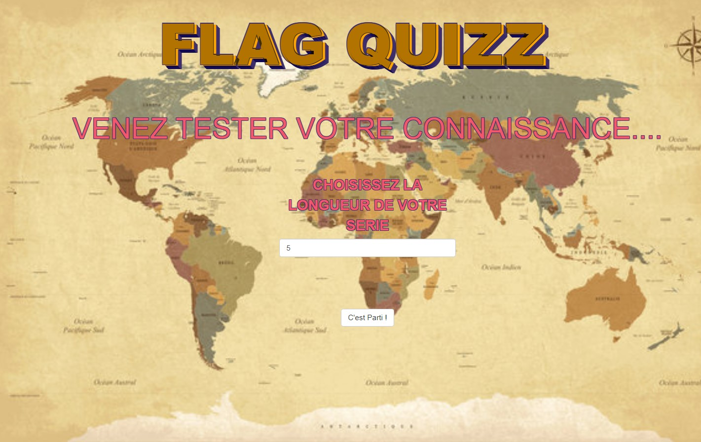

<!-- README.md is generated from README.Rmd. Please edit that file -->

```{r, include = FALSE}
knitr::opts_chunk$set(
  collapse = TRUE,
  comment = "#>",
  fig.path = "man/figures/README-",
  out.width = "100%"
)
```

# appflagquizz 

<!-- badges: start -->
<!-- badges: end -->

{appflagquizz} tests your knowledge of the flags of the world.

The quiz refers to the site [**https://www.monsieur-des-drapeaux.com**](https://www.monsieur-des-drapeaux.com/drapeaux-du-monde.html)

## How to install

```{r, eval = FALSE}
# Install and load {appflagquizz} package
# install.packages("remotes")
remotes::install_github("MurielleDelmotte/appflagquizz")
library(appflagquizz)
```

## How to run the app

```{r, eval = FALSE}
appflagquizz::run_app()
```

## Demo

Before starting, you will be able to choose the length of the quiz.

```{r echo=FALSE}

```
