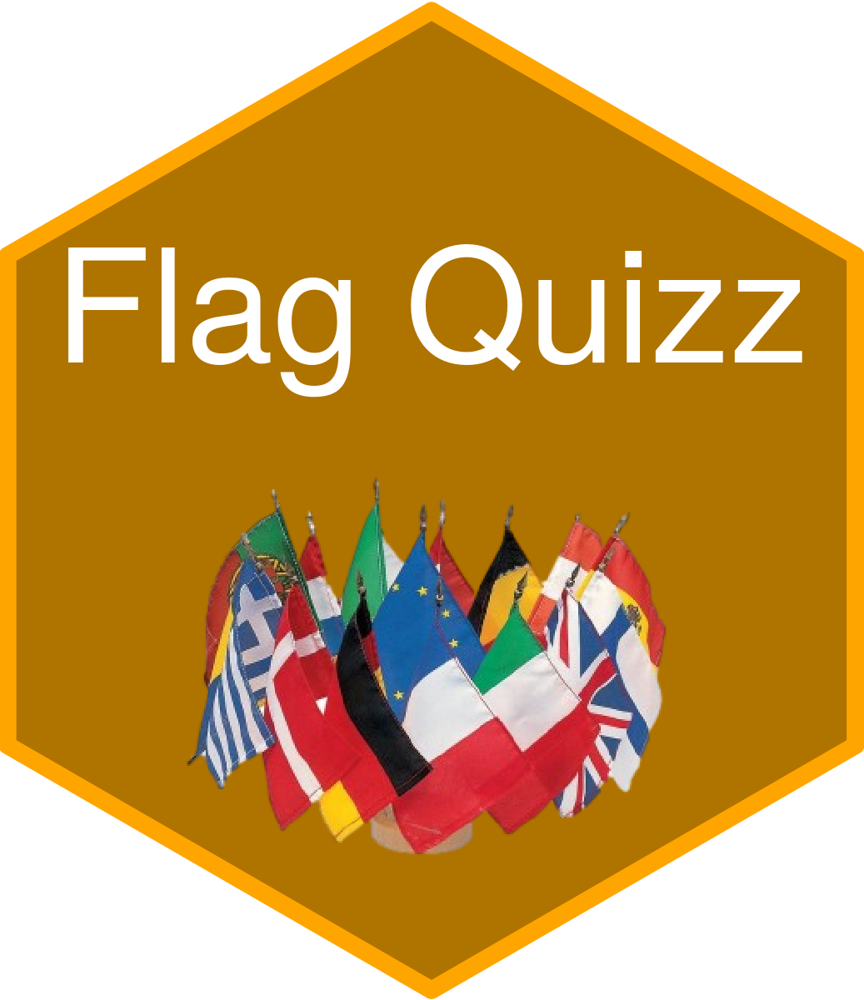
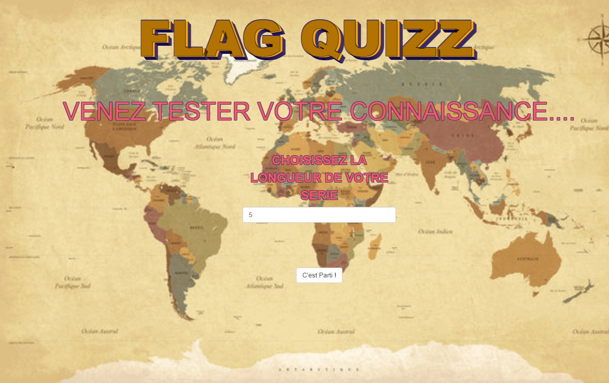

<!-- README.md is generated from README.Rmd. Please edit that file -->

# appflagquizz 

<!-- badges: start -->
<!-- badges: end -->

{appflagquizz} tests your knowledge of the flags of the world.

Before starting, you will be able to choose the length of the quiz.

The quiz refers to the site
[**https://www.monsieur-des-drapeaux.com**](https://www.monsieur-des-drapeaux.com/drapeaux-du-monde.html)

## Demo

